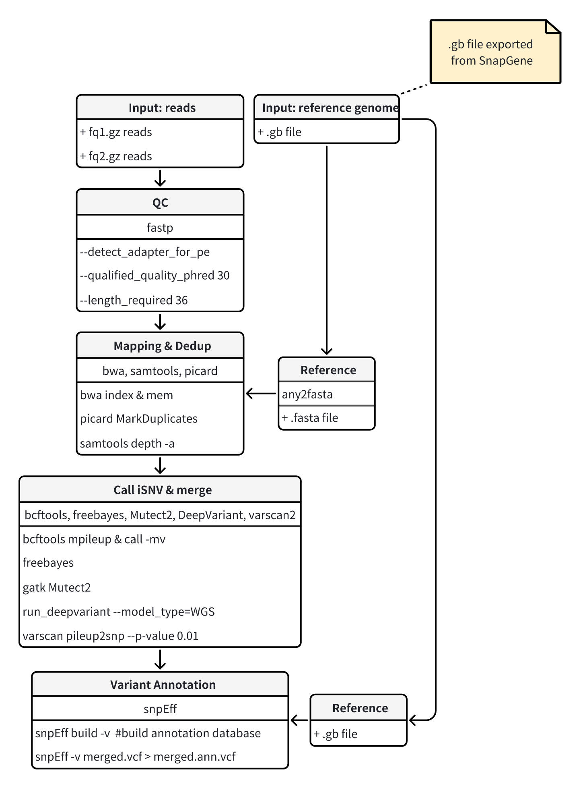

# RSV_SNV_Calling_pipeline

This repository contains a robust bioinformatics pipeline for the analysis of Respiratory Syncytial Virus (RSV) genomic data. Our workflow encompasses quality control, genome alignment, variant calling, and functional annotation, leveraging state-of-the-art tools and a multi-caller approach for high-confidence variant detection.

**Figure1. ** Workflow Diagram of Human Respiratory Syncytial Virus (RSV) SNV calling

### Data Preprocessing and Quality Control

Raw sequencing data were processed using fastp v0.23.2 to remove adapter sequences and low-quality reads. Reads with a quality score below 30 (Q30) and shorter than 36 bp were filtered out to ensure high-quality input for subsequent analyses (Chen et al., 2018).

### Alignment and Depth Calculation

Filtered reads were aligned to the viral reference genome using BWA-MEM v0.7.17. The reference genome used was the Human respiratory syncytial virus strain A2, complete genome, available from the NCBI GenBank database (GenBank: KT992094.1). PCR duplicates were marked and removed using Picard Tools v2.26.9. Sequencing depth was calculated using SAMtools v1.19.2 (Li, 2013; Broad Institute, 2019; Li et al., 2009).

### Variant Calling

To ensure comprehensive variant detection, we employed a multi-caller approach using five different variant calling algorithms: BCFtools v1.19 (Using htslib 1.19.1), FreeBayes v1.3.6, Mutect2 (GATK v4.2.5.0), Strelka v2.9.10, and VarScan v2.4.6. Additionally, we utilized DeepVariant v1.6.0, a deep learning-based variant caller, to complement our analysis. The reference genome used for variant calling was the Human respiratory syncytial virus strain A2 from the NCBI GenBank database (GenBank: KT992094.1) (Danecek et al., 2021; Garrison & Marth, 2012; Benjamin et al., 2019; Kim et al., 2018; Koboldt et al., 2012; Poplin et al., 2018).

### Variant Annotation

Amino acid changes resulting from the detected variants were annotated using SnpEff v5.2. A custom annotation database was built using the Human respiratory syncytial virus strain A2 reference genome from the NCBI GenBank database (GenBank: KT992094.1) to ensure accurate functional predictions (Cingolani et al., 2012).

## Reference

1. Chen, S., Zhou, Y., Chen, Y., & Gu, J. (2018). fastp: an ultra-fast all-in-one FASTQ preprocessor. Bioinformatics, 34(17), i884-i890.
2. Li, H. (2013). Aligning sequence reads, clone sequences and assembly contigs with BWA-MEM. arXiv preprint arXiv:1303.3997.
3. Broad Institute. (2019). Picard toolkit. GitHub Repository.(https://github.com/broadinstitute/picard)
4. Li, H., et al. (2009). The Sequence Alignment/Map format and SAMtools. Bioinformatics, 25(16), 2078-2079.
5. Danecek, P., et al. (2021). Twelve years of SAMtools and BCFtools. GigaScience, 10(2), giab008.
6. Garrison E, Marth G. Haplotype-based variant detection from short-read sequencing. arXiv preprint arXiv:1207.3907 [q-bio.GN] 2012
7. Benjamin, D., et al. (2019). Calling Somatic SNVs and Indels with Mutect2. bioRxiv, 861054.
8. Kim, S., et al. (2018). Strelka2: fast and accurate calling of germline and somatic variants. Nature Methods, 15(8), 591-594.
9. Koboldt, D. C., et al. (2012). VarScan 2: somatic mutation and copy number alteration discovery in cancer by exome sequencing. Genome Research, 22(3), 568-576.
10. Poplin, R., et al. (2018). A universal SNP and small-indel variant caller using deep neural networks. Nature Biotechnology, 36(10), 983-987.
11. Cingolani, P., et al. (2012). A program for annotating and predicting the effects of single nucleotide polymorphisms, SnpEff: SNPs in the genome of Drosophila melanogaster strain w1118; iso-2; iso-3. Fly, 6(2), 80-92.
